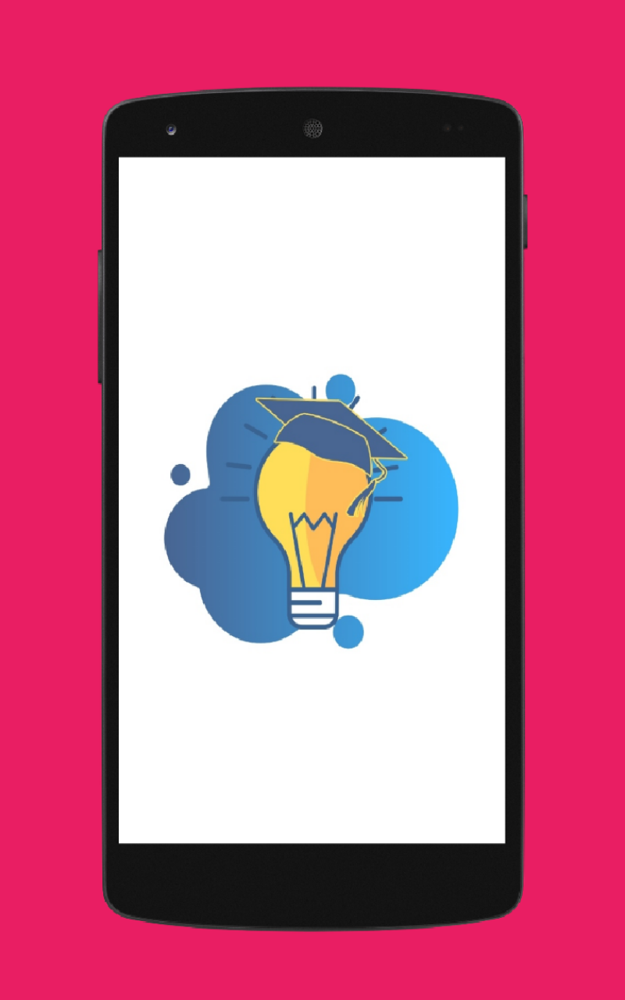
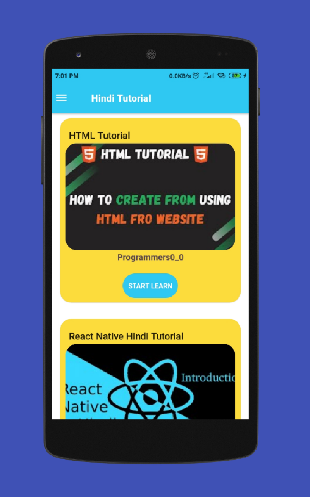
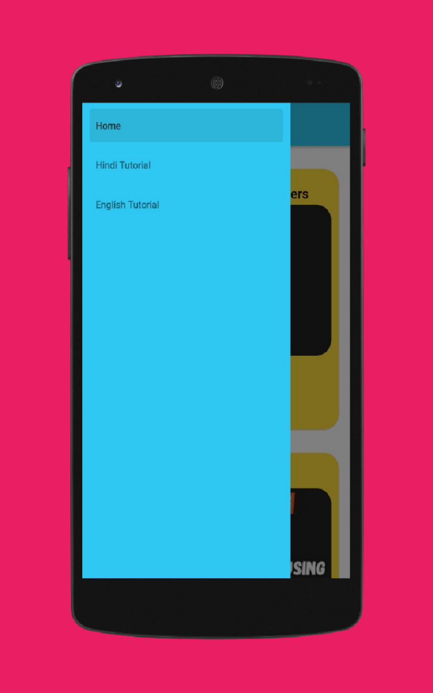
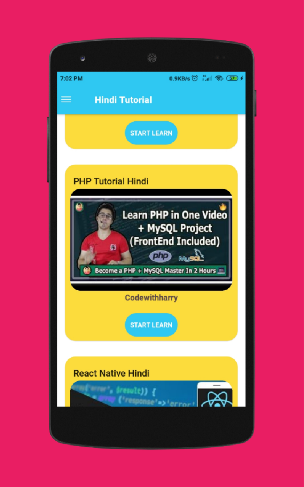

# Free-Learning-App
 

	<h2>This application create for provide free learnig resource.</h2>

<h3>Description:</h3>

Welcome To Free Learning Application.
This is Free Learning Application are Provide Free Learning Video Resource.
There are many Video Tutorials are available in different programming languages.

 

List of Cources: 
 -React Native
 -Flutter
 -HTML
 -Python
 -PHP
 -JavaScript
 -C
 -C++
 -JAVA
 -C#
 -Ruby
 -Kotlin
 -SQL
 -And Many others
	

	

<h2><a href="https://www.amazon.com/dp/B08P5F7WBD/ref=apps_sf_sta">GET THIS APP</a></h2>

NOTE: This application are available  only Amazon App store.
	

<h3>Features:</h3>
		<li>Small Pocket Application</li>
		<li>Learn Different Programming Languages for free.</li>
		<li>React Native</li>
		<li>Flutter</li>
		<li>HTML</li>
		<li>Python</li>
		<li>PHP</li>
		<li>JavaScript</li>
		<li>JAVA</li>
		<li>And Many others</li>

<h3>App ScreenShort::</h3>

   
